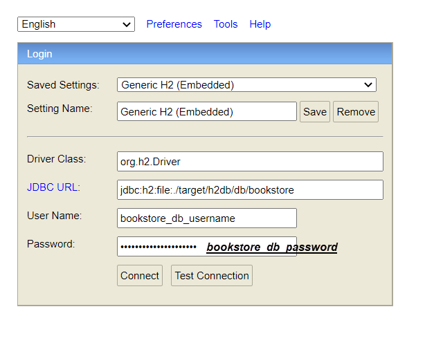
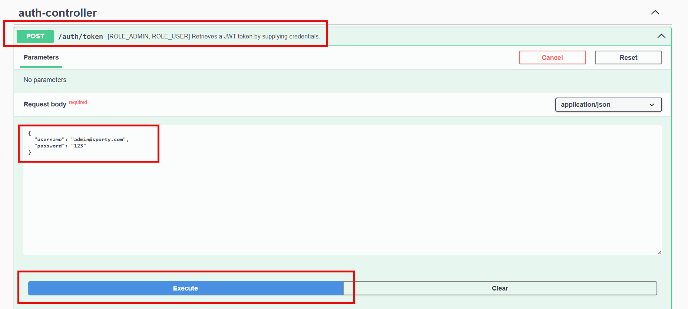
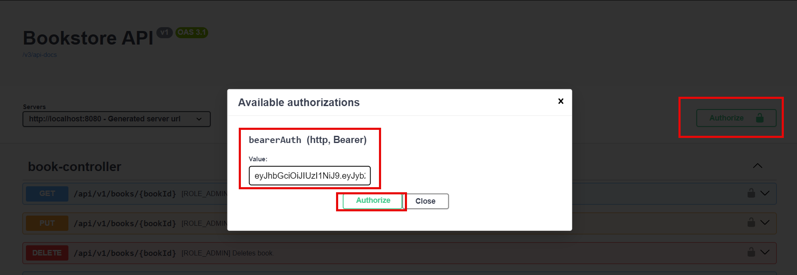

# Bookstore Microservice

This project is built using Java 17 and Spring Boot 3.4.2.

For the persistence layer we have JPA (Hibernate) over H2 file database.

The username and password for the DB are hardcoded inside the properties file -- for ease of use.
In a production scenario we would have them encrypted or fetched from a configuration server/cloud secret manager.

For DB migrations we use Liquibase.

## How to run it

Within this repository there is an `execution` folder which contains a `bookstore.jar` file:

- Make sure that the Java version at your `Path` is set to 17.
- Navigate to the `execution` folder and run `java -jar bookstore.jar`.

Second option is to go to the root of this project and run `mvn spring-boot:run`.
You can also use the mvn wrapper and run `mvnw spring-boot-:run`. You will need to make sure that mvn is configured to use Java 17.

You can access the application at port `8080`. Make sure this port is available before running.

The Swagger doc for the API is available here: http://localhost:8080/swagger-ui/index.html

You can connect to the DB by following this URL: http://localhost:8080/h2-console

The following window will pop up:

Just use the exact values as in the image to connect.
After connecting you will be able to run queries directly.

## Security

Spring Security and JWT tokens are used for protecting our API.

We have two roles:
- ADMIN
- USER

Three users are created by default by our DB migrations:
- ID: 1; username: admin@sporty.com; roles: ROLE_ADMIN; password: 123
- ID: 2; username: user1@sporty.com; roles: ROLE_USER; password: 123
- ID: 3; username: user2@sporty.com; roles: ROLE_USER; password: 123

## API description

The following endpoints are available (for more info consult the Swagger doc):
- Auth API
  - POST /auth/token -- retrieves a token by supplying a username and password
- User API
  - POST /api/v1/users -- creates a user (callable by ADMIN only)
  - GET /api/v1/users/{userId} -- gets a given user's profile (callable by ADMIN only)
  - GET /api/v1/users/me -- gets logged-in user's profile
- Book API
  - GET /api/v1/books -- searches books by various criteria; we use JPA `Specification` for elegantly handling dynamic searching
  - GET /api/v1/books/{bookId} -- gets book by its ID
  - POST /api/v1/books -- creates a book (callable by ADMIN only)
  - PUT /api/v1/books/{bookId} -- updates a book (callable by ADMIN only)
  - DELETE /api/v1/book/{bookId} -- deletes a book (callable by ADMIN only); only OLD_EDITION books can be deleted
- Loyalty Points API
  - GET /api/v1/loyalty-points/{userId} -- gets loyalty points for a given user (callable by ADMIN only)
  - GET /api/v1/loyalty-points/me -- gets loyalty points for the logged-in user
- Order API
  - POST /api/v1/orders/summarise -- sends books along with their quantity for summation; the response gives an overview of the price that needs to be paid (along with other details)
  - POST /api/v1/orders/purchase -- sends books along with their quantity for purchase; calling this endpoint updates/applies the loyalty points for the logged-in user

#### Minor details concerning pricing
- Currencies are not taken into account for ease of use. The price is simpy just a number.
- The maximum number of loyalty points a user can have is 10. Purchasing more books will not enlarge this number. Loyalty points can also be spent and gained within the same order. For example, let's say a user has 10 points. He buys 3 books, one of which is free. He ends up with 2 loyalty points. The maximum number of free books per order is 1. The most expensive book in the order will be picked when deciding which of the books should be free.  

## How to use the Swagger doc

The Swagger doc enables you to set a Bearer token which it will send on your every request.

First, fetch token:

After copying the token from the response you will need to paste it here (keep in mind that you do not need to supply the "Bearer " prefix -- Swagger will do that automatically on each subsequent request you send via its UI):

## Code organization

The code packages are divided by features:
- `user`
- `inventory`
- `purchase`

For the general functionalities we use packages outside the three mentioned above.
This includes functionalities like:
- Exceptions and error handling
- API annotations for validation, sorting, etc...
- API constants
- Swagger doc config
- JPA audit config

Our unit/integration tests' packages are divided in a similar way.

## Strategy design pattern

When calculating the discounted book prices, we use a pattern called `Strategy`.

We have an interface called `DiscountProcessor`, and we have three Spring `@Service`s that implement it:
- `OldEditionDiscountProcessor`
- `RegularDiscountProcessor`
- `NewReleaseDiscountProcessor`

This way, adding new book types is easy. We just need to add a new implementation for the `DiscountProcessor`, without touching the existing code. This satisfies SOLID's Open/Closed principle.

